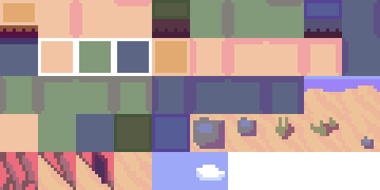

# Alterdune – GDD

  

## 1. Especificaciones básicas
- **Plataforma:** PC  
- **Género:** Puzzle / Aventura 2D (top-down)  
- **Público objetivo:** 12+  
- **Cámara:** Vista aérea fija por sala con transiciones  
- **Estilo visual:** Pixel art  
- **Multijugador:** 2–4 jugadores  

  

---

## 2. Concepto
Juego de puzles en vista superior ambientado en un templo desértico antiguo.  
Los jugadores recorren laberintos donde deben presionar botones o recoger llaves para abrir puertas y avanzar hasta el final.  
El progreso es lineal: introducción → tres laberintos → fin.

### Objetivo
Completar los tres laberintos del templo resolviendo los pequeños puzles que bloquean cada salida.

### Mecánicas principales
- Movimiento 4 direcciones (WASD)
- Interacción (E) con botones o llaves
- Puertas que se abren al recoger una llave o pulsar un botón
- Progresión por niveles lineal (sin combate ni enemigos)

---

## 3. Controles
- **WASD**: mover  
- **E**: interactuar (usar botón / recoger llave)  
- **R**: reiniciar nivel  

---

## 4. Flujo de juego (resumen)
Inicio → Intro (se muestran los controles) → Personajes entran al templo → Laberinto 1 → Laberinto 2 → Laberinto 3 → Fin.

  

---

## 5. Progresión y niveles
- **Intro:** los personajes aparecen frente al templo, se muestran los controles.  
- **Laberinto 1:** camino sencillo con un botón que abre la salida.  
- **Laberinto 2:** se obtiene una llave que desbloquea una puerta.  
- **Laberinto 3:** combina los dos elementos.  
- **Fin:** pantalla final o animación simple tras completar el templo.  

---

## 6. Diseño visual
- **Paleta:** tonos piedra y arena con acentos dorados o rojos en elementos interactivos.  
- **UI mínima:** contador de llaves, texto de nivel y botón “Reiniciar”.  
- **Logo:** “Alterdune” con tipografía pixel y textura de arena.  
- **Inspiración visual:** templos antiguos, estructuras geométricas y minimalismo.  

  
  
  

---

## 8. Narrativa
Almas llegan a un templo perdido bajo la arena.  
Al entrar, quedan atrapadas y deben avanzar resolviendo los mecanismos que bloquean el paso.  

  

  

---

## 9. Sonido
- **Música:** musica ambiental de desierto.
- **FX:** clic de botones, obtención de llave, apertura de puerta, pasos sobre piedra y sonido final de salida.

