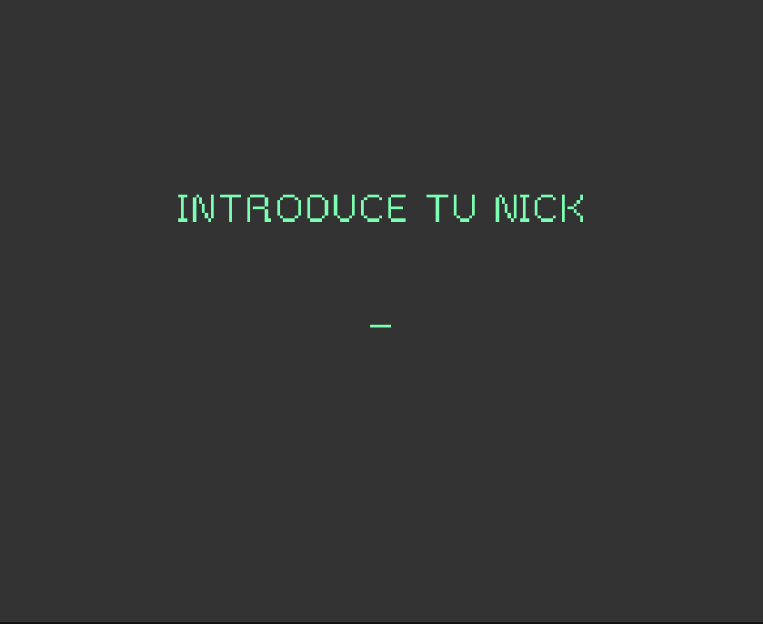
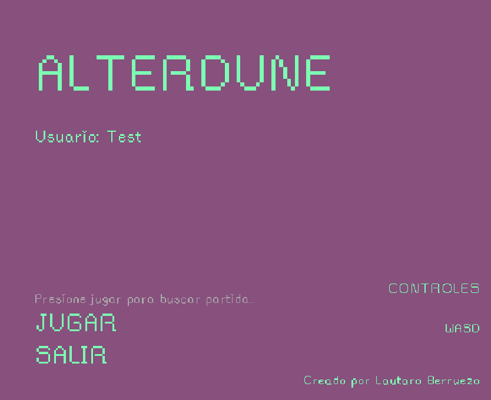
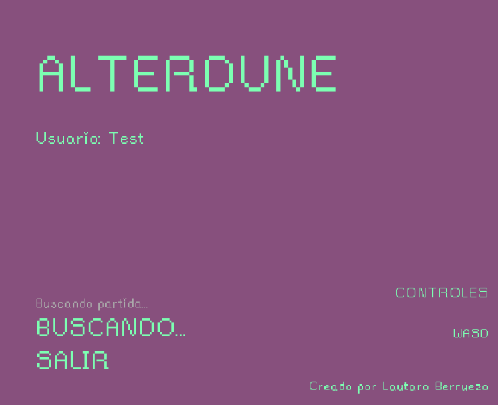
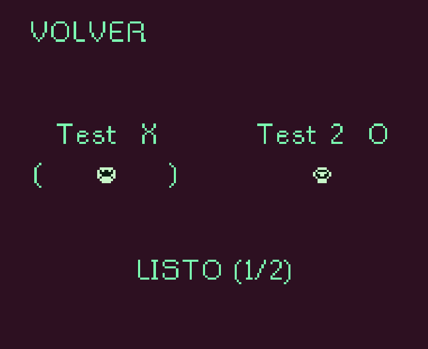
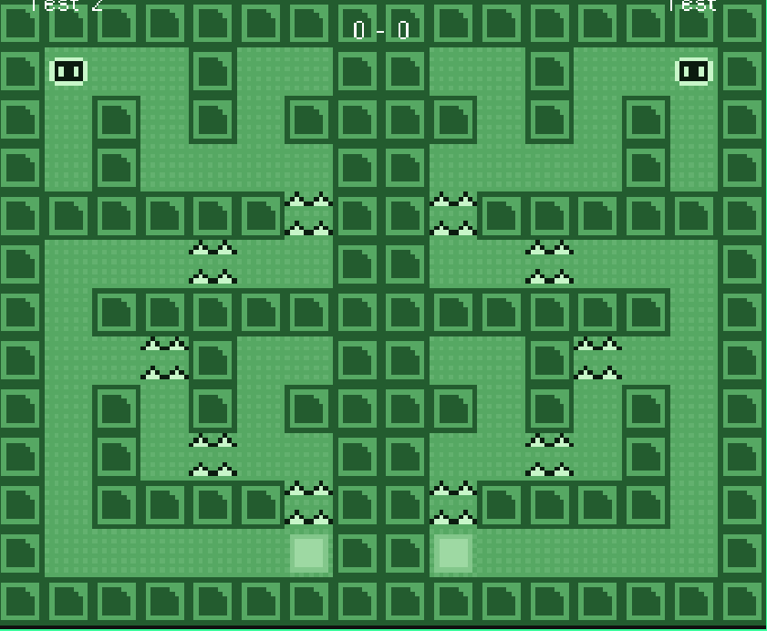
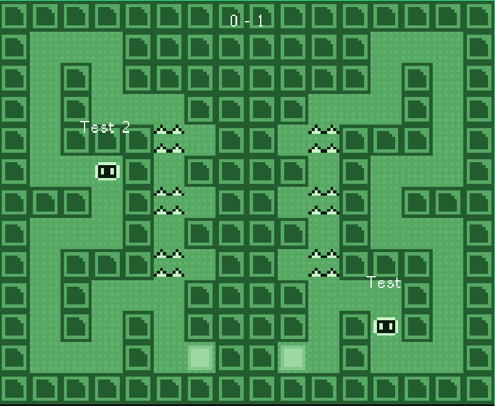
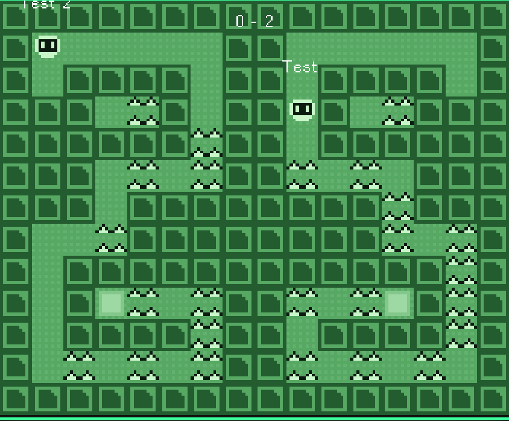
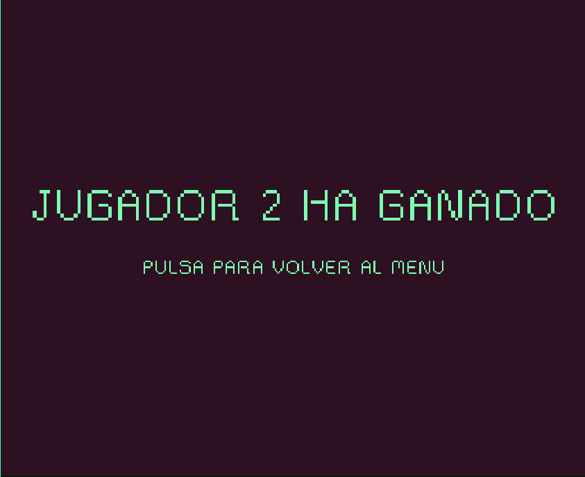
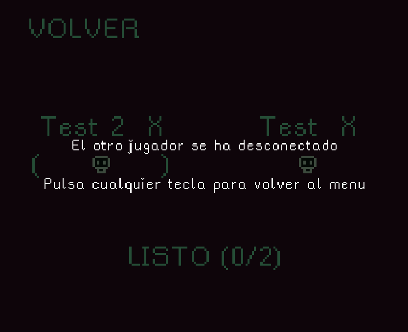
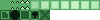

# Alterdune – GDD

## 1. Especificaciones básicas
- **Plataforma:** PC (navegador)
- **Género:** Puzzle / Aventura 2D en vista superior
- **Público objetivo:** 12+
- **Cámara:** Vista aérea fija por sala
- **Estilo visual:** Pixel art con estética neón
- **Multijugador:** 2 jugadores online

---

## 2. Concepto
Alterdune se desarrolla dentro de un entorno digital abstracto, representado como un sistema verde y neón compuesto por celdas, pasillos y trampas.

Los jugadores controlan dos virus informáticos que han sido liberados dentro del sistema y compiten por llegar al final del recorrido.  
El sistema intenta eliminarlos mediante trampas distribuidas por los laberintos, principalmente pinchos que dañan al jugador al contacto.

La experiencia es competitiva y directa: ambos jugadores recorren los mismos laberintos y el ganador se decide según su rendimiento y puntuación.

### Objetivo
Llegar al final de los tres laberintos del sistema obteniendo la mayor puntuación posible y superando al otro virus.

### Mecánicas principales
- Movimiento en cuatro direcciones sobre una cuadrícula
- Trampas de pinchos que penalizan al jugador al contacto
- Reaparición del jugador tras recibir daño
- Sistema de puntuación competitivo entre dos jugadores
- Progresión lineal por niveles
- No existe combate ni interacción directa entre jugadores

---

## 3. Controles
- **Jugador 2:** W / A / S / D

---

## 4. Flujo de juego (resumen)
Pantalla de login
Menú principal  
Búsqueda de partida  
Selección de personaje  
Laberinto 1  
Laberinto 2  
Laberinto 3  
Pantalla final

---
### Pantalla de login

  

El jugador introduce su nickname para identificarse en el servidor.
Hasta completar este paso no es posible acceder al menú ni al modo multijugador.

---

### Menú principal (sin buscar partida)

  

Estado inicial del menú principal.
Desde aquí el jugador puede iniciar la búsqueda de partida o salir del juego.

---

### Menú principal (buscando partida)

  

El jugador entra en la cola de matchmaking.
El sistema queda a la espera de que haya otro jugador disponible para crear una partida.

---

### Selección de personaje

  

Una vez encontrada la partida, ambos jugadores acceden a la selección de personaje.
Aquí eligen su virus jugable y confirman que están listos para comenzar.

---

### Laberinto 1

  

Primer laberinto del juego.
Sirve como toma de contacto con el movimiento, la estructura del nivel y las trampas básicas.

---

### Laberinto 2

  

Segundo laberinto, más complejo que el anterior.
Los caminos son más ajustados y las trampas obligan a moverse con mayor precisión.

---

### Laberinto 3

  

Último laberinto de la partida.
Es el nivel más exigente y suele ser decisivo para determinar el ganador.

---

### Pantalla final

  

Pantalla de cierre de la partida.
Se muestra el resultado final y qué jugador ha ganado según su rendimiento.

---

### Desconexión durante la selección

  

Si uno de los jugadores se desconecta durante la selección de personaje,
la partida se cancela automáticamente y el jugador restante vuelve al menú.

---

### Desconexión durante la partida

  

Cuando una desconexión ocurre durante un laberinto, la partida finaliza de inmediato.
El jugador que permanece conectado es informado y se le devuelve al menú principal,
evitando estados inconsistentes o partidas incompletas.

---

## 5. Diseño visual
- **Paleta:** tonos verdes y neón sobre fondos oscuros, simulando un entorno digital.
- **Escenarios:** construidos a partir de bloques y pasillos claramente definidos.
- **Interfaz en partida:** marcador simple que muestra la puntuación de ambos jugadores en formato X - Y.
- **Logo:** “Alterdune” con tipografía pixel de alto contraste.
- **Inspiración visual:** estética de sistemas digitales y videojuegos clásicos en vista superior.

### Tileset y escenarios
El juego utiliza un **tileset personalizado** que incluye:
- Suelo y paredes del laberinto
- Elementos de colisión
- La meta final con **animación de glow** para indicar visualmente la salida del nivel

  

---

## 6. Diseño de niveles y GridEngine
El movimiento y la lógica de colisiones del juego se gestionan mediante **GridEngine**, lo que permite trabajar sobre un sistema de celdas.

Cada laberinto está diseñado en **Tiled** y exportado como archivo `.tmj`.  
Estos mapas definen:
- la estructura del laberinto
- las paredes
- las zonas con pinchos
- la posición de la meta

Este enfoque permite modificar o crear nuevos niveles sin necesidad de cambiar la lógica del juego.

---

## 7. Multijugador y servidor
Alterdune utiliza una arquitectura cliente-servidor.

El cliente está desarrollado con Phaser 3 y el servidor con Node.js y Express.  
La comunicación se divide en:
- Peticiones REST para el login y la búsqueda de partida.
- Socket.IO para la sincronización en tiempo real durante la selección y la partida.

Durante la partida:
- Los movimientos se sincronizan en tiempo real.
- El servidor controla el estado de la partida.
- Si un jugador se desconecta, la partida finaliza para ambos.

---

## 9. Narrativa
Dos virus han conseguido infiltrarse en un sistema cerrado.  
El sistema responde generando trampas para eliminarlos antes de que lleguen al núcleo.

Solo el virus que logre avanzar con menos errores y mayor precisión conseguirá sobrevivir y escapar del sistema.

### Personajes (virus)
Los jugadores pueden elegir entre distintos **virus jugables**, representados como variaciones de color y animación.

Estas variantes no cambian las mecánicas, pero permiten:
- Identificar fácilmente a cada jugador
- Personalizar la experiencia en el lobby

  

### Efectos visuales
Cuando un jugador muere al tocar pinchos, se reproduce un **efecto de desaparición** antes del respawn.
Este efecto refuerza visualmente la penalización y comunica claramente el evento al otro jugador.

  

---

## 10. Sonido
- **buttonSound.mp3:** sonido al interactuar con la interfaz.
- **deathSound.wav:** se reproduce cuando un jugador toca los pinchos.
- **spikeAscend.wav:** sonido asociado a la activación de las trampas.
- **levelComplete.wav:** sonido al completar un laberinto.
- **Música:** sonidos electrónicos suaves que refuerzan la ambientación digital.

