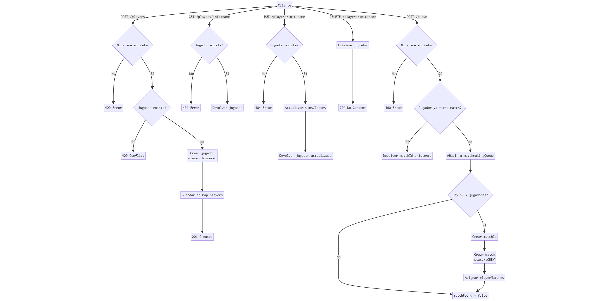

# Alterdune

Juego multijugador competitivo 2D en vista superior desarrollado como proyecto universitario para la asignatura **Juegos en Red**.

En este juego dos jugadores compiten atravesando laberintos evitando trampas, sincronizados en tiempo real mediante WebSockets.

---

## Información académica

- **Asignatura:** Juegos en Red
- **Grado:** Diseño y Desarrollo de Videojuegos
  
## Autor

- **Nombre:** Lautaro Berruezo
- **Grupo:** Grupo 11
- **Repositorio GitHub:** https://github.com/Kriboij/Alterdune-Fase-4
- **GDD:** [GDD.md](./GDD.md)

---

## Tecnologías

- **Cliente:** Phaser 3 (JavaScript)
- **Motor de movimiento en grid:** GridEngine (plugin para Phaser 3)
  - Gestión de movimiento por celdas
  - Control de colisiones y restricciones del mapa
  - Integración con mapas diseñados en Tiled
  - https://github.com/Annoraaq/grid-engine
- **Servidor:** Node.js + Express
- **Comunicación:**
  - API REST para login, gestión de usuarios y matchmaking
  - WebSockets (Socket.IO) para la lógica de juego en tiempo real

---

## Arquitectura

El proyecto sigue una arquitectura **cliente-servidor autoritativa**:

- El **cliente**:
  - Renderiza el juego
  - Envía inputs (movimiento, selección de personaje, estado de listo)
- El **servidor**:
  - Mantiene el estado real de usuarios y partidas
  - Decide cuándo se crea, empieza y termina una partida
  - Sincroniza eventos entre jugadores
  - Gestiona desconexiones

El estado del servidor se mantiene **en memoria** (sin base de datos), ya que el objetivo del proyecto es académico.

---

## Flujo general del juego

1. Login de jugador (REST)
2. Menú principal
3. Matchmaking (REST)
  - Hace falta un mínimo de dos jugadores buscando para empezar partida
4. Lobby / selección de personaje (WebSocket)
5. Partida en tiempo real (WebSocket)
6. Pantalla final
7. Vuelta al menú

---

## API REST

### Diagrama de comunicación API REST

<p align="center">
  
</p>

## API CALLS

### POST /players
Registra un nuevo jugador en el servidor.

#### Request
```json
{
  "nickname": "player1"
}
```

#### Responses

**201 Created**
```json
{
  "nickname": "player1",
  "wins": 0,
  "losses": 0,
  "createdAt": "2026-01-01T00:00:00.000Z"
}
```

**400 Bad Request**
```json
{
  "error": "nickname requerido"
}
```

**409 Conflict**
```json
{
  "error": "Jugador ya existe"
}
```

---

### GET /players/:nickname
Obtiene la información de un jugador.

#### Response
```json
{
  "nickname": "player1",
  "wins": 3,
  "losses": 1,
  "createdAt": "2026-01-01T00:00:00.000Z"
}
```

**404 Not Found**
```json
{
  "error": "No existe"
}
```

---

### PUT /players/:nickname
Actualiza las estadísticas de un jugador.

Este endpoint se utiliza al finalizar una partida para registrar si el jugador ha ganado o perdido.

#### Request
```json
{
  "wins": 1,
  "losses": 0
}
```

#### Response
```json
{
  "nickname": "player1",
  "wins": 4,
  "losses": 1,
  "createdAt": "2026-01-01T00:00:00.000Z"
}
```

**Notas**
- Cada partida incrementa **wins** o **losses** en función del resultado.
- La puntuación por partida es fija, por lo que se almacenan estadísticas de victorias/derrotas.

---

### DELETE /players/:nickname
Elimina un jugador del servidor (logout).

#### Response
```text
204 No Content
```

---

### POST /queue
Añade un jugador a la cola de matchmaking.

#### Request
```json
{
  "nickname": "player1"
}
```

#### Response – partida no encontrada
```json
{
  "matchFound": false
}
```

#### Response – partida encontrada
```json
{
  "matchFound": true,
  "matchId": "uuid-del-match"
}
```

---

## Comunicación WebSocket

La comunicación WebSocket se utiliza para la **ejecución en tiempo real de la partida** y la **sincronización entre jugadores** una vez creada la partida mediante REST.

### Diagrama de comunicación WebSocket

<p align="center">
  
</p>

### Funcionamiento general

- El cliente se conecta al servidor mediante Socket.IO.
- La asociación a una partida se realiza explícitamente mediante `match:join`.
- El servidor valida el `matchId` y gestiona reconexiones y nuevos jugadores.
- El estado del lobby se sincroniza mediante `match:update`.

Durante la partida:
- Los jugadores envían **inputs de movimiento**, no posiciones absolutas.
- El servidor reenvía los eventos al otro jugador.
- La posición se corrige puntualmente mediante `player:sync` para evitar desincronizaciones.
- Eventos como respawn se sincronizan con `player:respawn`.

El servidor mantiene siempre el **control del estado de la partida** y finaliza el match ante cualquier desconexión.

---

## Gestión de desconexiones

- El servidor escucha el evento `disconnect` de Socket.IO.
- Si un jugador se desconecta durante una partida:
  - La partida se finaliza automáticamente.
  - Se notifica al otro jugador.
  - Se libera el estado del match para permitir nuevas partidas.

---

## Limitaciones conocidas

- Estado del servidor mantenido únicamente en memoria.
- No existe persistencia en base de datos.
- No hay sistema de reconexión con timeout.
- Autenticación basada únicamente en nickname.

Estas decisiones se han tomado por el alcance académico del proyecto.

---


